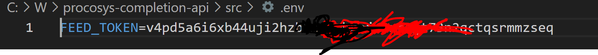
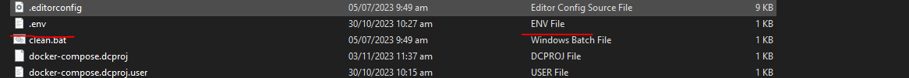
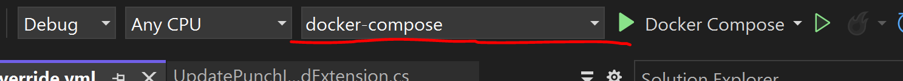

# procosys-completion-api
[](https://developer.equinor.com/governance/scm-policy/)

REST API for the completion module in Project Completion System (ProCoSys (PCS))

### Secrets
Before running the application, some settings need to be set. These are defined in appsettings.json. To avoid the possibility to commit secrets, move parts of the configuration to the secrets.json file on your computer.
Typical settings that should be moved to secrets.json are:
* AD IDs
* Keys
* Local URLs
* Other secrets
### Migration
When running in development environment, the database is auto-migrated on application startup. This can be changed using the setting in appsettings.development.json.

### Seeding
The database can be seeded with test data. To do this, enable the feature in appsettings.development.json and start the application.
>Note: This will run every time the application starts. To avoid multiple seedings, disable the feature after the application has started.

## Visual Studio
### Set secrets
To open secrets.json, right-click on the startup project and select 'Manage User Secrets'.
### Run

Choose to run as *Equinor.ProCoSys.Completion.WebApi* in the dropdown menu and hit F5.


## Run the application using Docker Compose
This guide will help you set up your local environment to run the application using Docker Compose.

### Prerequisites

- Docker and Docker Compose installed.
- Access to ProCoSys Official NuGet feed.
- Access to Azure Container Registry.

### Configuration

Before running the application, you need to set up the following:

### 1. Secret.json

Ensure you have a populated `secret.json` created from Equinor.ProCoSys.Completion.WebApi.
Either with full setup, or minimal.
Ask a colleague for a copy if you dont have one.

### 2. Environment Variables

Create a `.env` file in the src directory (next to docker-compose) with the following content:
>FEED_TOKEN= YourAccessTokenHere



.env is and should be ignored by git.
>Note: Make sure to double check that this file is not added to source control.



The .env file should never be checked in to source control. As long as its placed in the src folder, it will be ignored by git.
But always double check before committing.

Replace `ACCESSTOKEN` with your actual access key to the ProCoSys Official NuGet feed.
We use Personal AccessTokens and the token needs the permission `Packaging (read)`.
This means that you give the container permission to access the feed on your behalf.
If you dont already have one, it can be created here: https://statoildeveloper.visualstudio.com/_usersSettings/tokens

### 3. Login to Azure Container Registry

Follow the guide provided [here](https://github.com/equinor/procosys-infra/tree/master/db-dev) to log in to the Azure Container Registry from your command window.

### 4. Update Database Connection String

Modify the `server` part of the database connection string to use `db` instead of `127.0.0.1` .
You find the connection string in the `secret.json`. Change the value of  `"ConnectionStrings:CompletionContext":` 

from `Server=127.0.0.1;Database=pcs-co...`

to `Server=db;Database=pcs-co...`

### Setting up self trusted certificate

run the following command to add a self trusted certificate for the project in a folder where docker can reach it (the folder we mount)

```
dotnet dev-certs https -ep $env:APPDATA\ASP.NET\Https\Equinor.ProCoSys.Completion.WebApi.pfx -p <superSecretPassword>
```

and then
```dotnet dev-certs https --trust```

add this line to `secret.json` using the same password

```
"Kestrel:Certificates:Development:Password":  "<superSecretPassword>",
```

### Running the Application

Once all configuration is done, you can start the application by running the following command from the src folder:

`cd src` and then

```docker compose up```

This will pull the necessary images, build the services, and start the application. You can access it once it's up and running.

>To debug in the container, you can run the application from visual studio or rider.



### Sandbox image
There is a sandbox image available at procosys.azurecr.io/completion/sandbox:latest. IDs in this image matches IDs in
the main sandbox image. This sandbox image is based on this backup [pcsdevsa/sql-db-backup-sandbox/pcs-completion-dev-db](https://pcsdevsa.blob.core.windows.net/sql-db-backup-sandbox/pcs-completion-dev-db.bacpac)

### One Team
The [One Team Documentation](https://docs-procosys-one-team-docs-prod.radix.equinor.com/) has higher level documentation
for the program. Please familiarize yourself with it.

### Handy
Deleting all local branches except for main
```Bash
git for-each-ref --format '%(refname:short)' refs/heads | grep -v "main" | xargs git branch -D 
```
